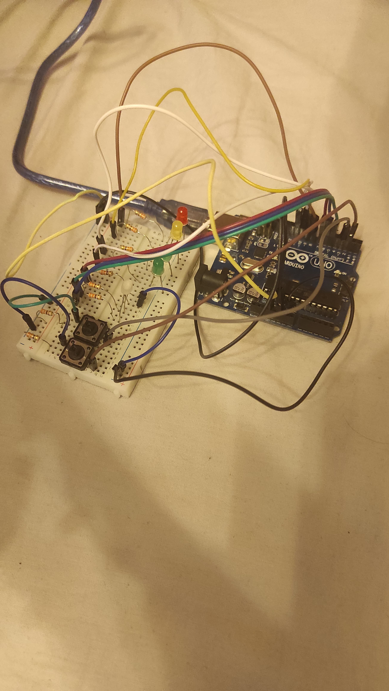
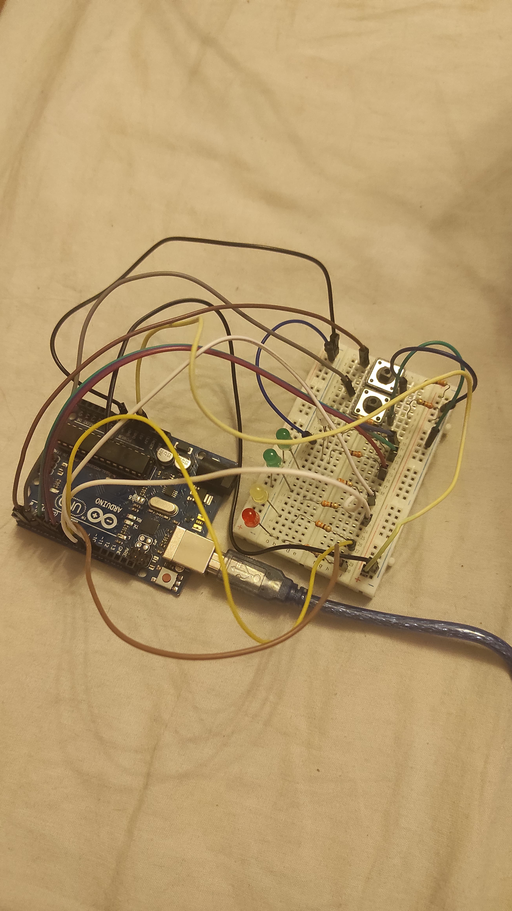
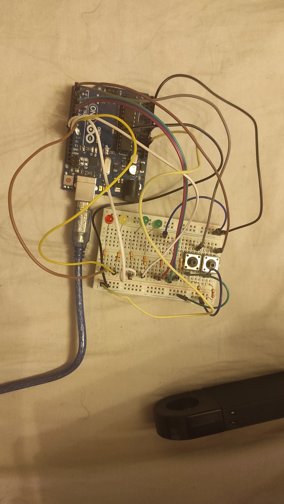

# Simulare Stație de Încărcare cu Arduino UNO

## Cerința Inițială

Starea stației este ‘liberă’. Loader-ul este stins, iar LED-ul pentru disponibilitate este verde. Se apasă butonul pentru start. LED-ul pentru disponibilitate devine roșu, iar procesul de încărcare începe cu aprinderea primului LED L1. LED-ul 1 clipește timp de 3 secunde, celelalte fiind stinse. După încărcarea primului procent de 25%, LED-ul rămâne aprins și se trece la următorul LED, care începe să clipească. La finalizarea încărcării, toate LED-urile vor clipi simultan de 3 ori, după care se vor stinge, semnalizând finalizarea procesului. LED-ul pentru disponibilitate devine verde. Dacă se apasă butonul de stop pe durata încărcării, încărcarea se întrerupe iar LED-ul pentru disponibilitate devine verde.

## Descrierea Proiectului

Acest proiect simulează funcționarea unei stații de încărcare utilizând un Arduino UNO. Stația începe în starea "liber", indicată de LED-ul verde de disponibilitate. La apăsarea butonului de start, începe procesul de încărcare, care este reprezentat de patru LED-uri, fiecare indicând un progres de 25%.

- Fiecare LED clipeste timp de 3 secunde înainte de a rămâne aprins, trecând de la 25% la 100%.
- La finalizarea încărcării, toate LED-urile clipesc de 3 ori înainte de a se stinge, semnalizând sfârșitul procesului.
- Dacă se apasă butonul de stop în timpul încărcării, procesul se întrerupe și LED-ul de disponibilitate revine la verde.

## Componente Utilizate

- **Placă Arduino UNO**
- **LED RGB** (pentru a indica disponibilitatea stației: verde pentru liber, roșu pentru ocupat)
- **4 LED-uri simple** (pentru a indica progresul de încărcare: 25%, 50%, 75%, 100%)
- **2 Butoane** (unul pentru Start și unul pentru Stop)
- **Rezistențe** (pentru protecția LED-urilor)
- **Breadboard** și **cabluri de conectare**

## Setup Fizic

## Video

[Watch the project video](./res/vid.mp4)