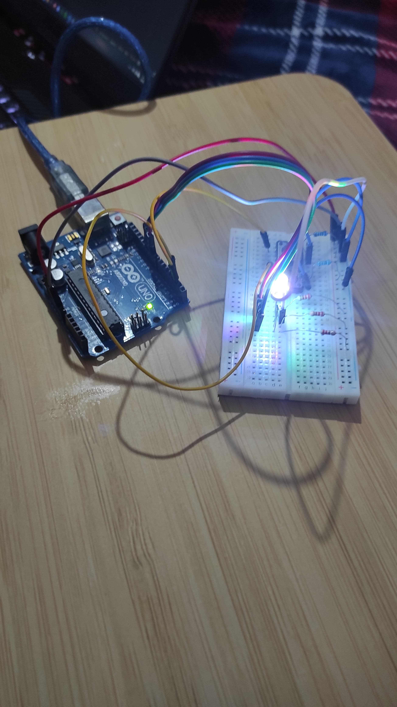
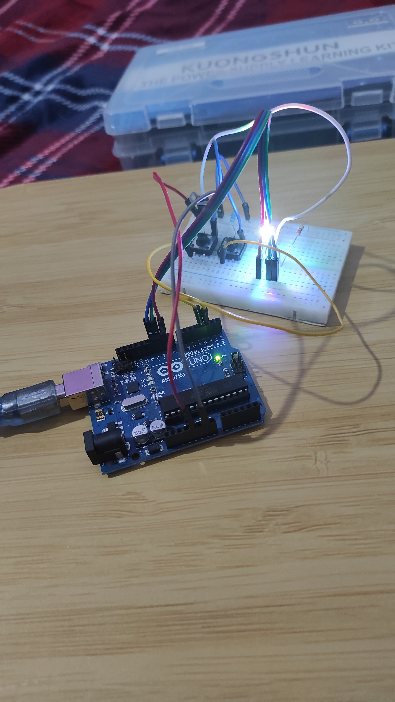
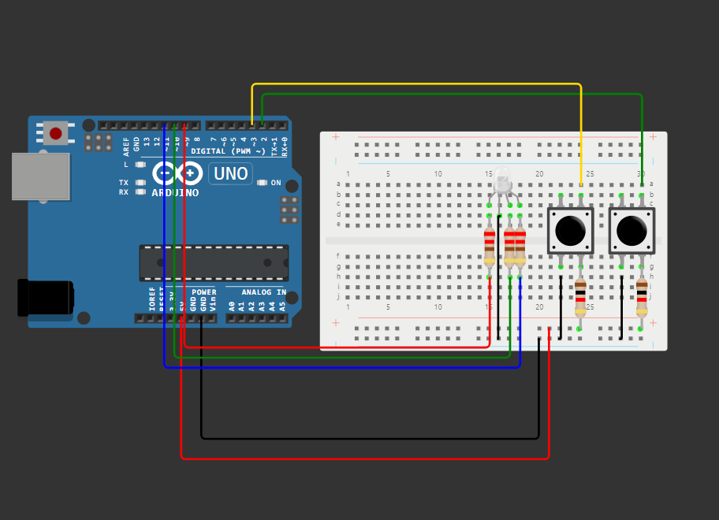

# TypeRacer Game with Arduino UNO

## Cerința Inițială

În această temă veți crea un joc asemănător cu TypeRacer.

## Descrierea Proiectului

Acest proiect simulează un joc de tip TypeRacer utilizând un Arduino UNO. Jocul începe în starea "repaus", indicată de LED-ul RGB alb. La apăsarea butonului de start, începe o numărătoare inversă de 3 secunde, timp în care LED-ul RGB clipește. După numărătoare, LED-ul devine verde și începe runda de tastare a cuvintelor afișate în terminal.

- LED-ul RGB indică starea jocului: alb pentru repaus, verde pentru runda activă, roșu pentru greșeală.
- Butonul de start/stop inițiază sau oprește runda.
- Butonul de dificultate schimbă viteza de apariție a cuvintelor (ușor, mediu, greu).
- Cuvintele sunt afișate în terminal și trebuie tastate corect pentru a primi puncte.
- La sfârșitul rundei, se afișează scorul total.

## Componente Utilizate

- **Placă Arduino UNO**
- **LED RGB** (pentru a semnaliza starea jocului)
- **2 Butoane** (unul pentru Start/Stop și unul pentru selectarea dificultății)
- **5 Rezistoare** (3x 220/330 ohm, 2x 1000 ohm)
- **Breadboard** și **cabluri de conectare**

## Setup Fizic

## Diagrama Wokwi

## Video

