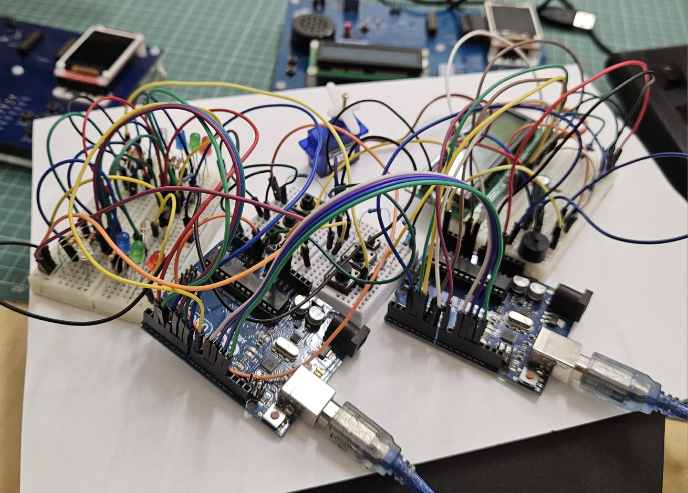

# Quick Time

## Detalii Tehnice

SPI: Tema aceasta implică foarte multe legături. Atât de multe încât un singur arduino uno nu ne oferă suficienți pini GPIO. De aceea pentru această temă este nevoie de 2 arduino uno care vor comunica folosind SPI. Arduinoul master va fi cel responsabil pentru controlul LCD-ului, servomotorului și va fi cel care ține în memorie starea jocului (ex. punctajul fiecărui jucator, ledul care trebuie să fie aprins acum, etc.). Arduino-ul slave va controla butoanele și ledurile, primind mesaje de la arduinoul master pentru a ști ce led să aprindă și trimițând înapoi mesaje despre butonul apăsat.

### Butoane:
Pentru începerea jocului butonul de start poate fi implementat în diverse moduri:
Orice buton începe jocul
Un anume buton începe jocul (ar trebui să fie clar pe breadboard care este acel buton care pornește jocul)• Un al 7-lea buton dedicat poate fi pus pentru pornirea jocului
Cât timp jocul este în desfășurare butoanele trebuie să poată fi folosite doar pentru controlul jocului și să nu reseteze progresul
Doar butoanele jucătorului din acea rundă trebuie să poată controla jocul
Chiar și cu 2 plăci arduino nu avem suficienți pini pentru toate componentele. De aceea, putem
multiplexa butoanele folosind rezistențe (www.youtube.com/watch?v=Y23vMfynUJ0)

### LED-uri:

Fiecare buton are asociat un LED de o culoare diferită. Pe parcursul jocului acestea trebuie să fie aprinse pentru a vedea cărei culoare îi corespunde fiecare buton
LED-ul rgb trebuie să se aprindă în una din cele 3 culori ale butoanelor
LED-ul rgb trebuie să fie stins dacă nu este runda jucătorului corespunzător acelui LED
### LCD:

Pentru controlul acestuia ne putem folosi de biblioteca LiquidCrystal
Trebuie să aibă setată o luminozitate și un contrast suficient de bune cât să fie vizibil textul pe ecran.
Vor fi folosiți doar pini D4-7 pentru liniile de date ale ecranului
Pe parcursul jocului trebuie să afișeze punctajele celor 2 jucători
### Servomotor:
Servomotorul va începe de la poziția de 0 grade și se va deplasa în sens antiorar pentru a indica scurgerea timpului.
Anteție la valoarea trimisă către servo-motor. Prin biblioteca Servo.h noi trimitem la servomotor rotație absolută, nu relativă la cea curentă.
### Bonus 
Starea inițială a jocului poate să aibă diverse elemente pentru a fi mai interesantă. Câteva exemple:Animație pe LCD,Animație din leduri,Adăugarea unui buzzer,Adăugarea,posibilității jucătorilor de-ași introduce numele
Buzzerul poate fi inclus pentru a a semnala răspunsurile corecte / greșite, începutul și finalul jocului sau chiar un theme song.
Pentru adăugarea numelui jucătorilor se pot folosi diverse metode:
### Butoane și joystick-uri
LCD-ul pentru a afișa numele care este introdus
Interfața serial (USART)

## Cerința

### Inițializare
Jocul pornește cu afișarea unui mesaj de bun venit pe LCD. Apăsarea unui buton declanșează startul jocului.
Pentru începerea jocului, butonul de start poate fi implementat într-un mod flexibil, rămânând la latitudinea studenților să aleagă una dintre următoarele variante:
In această variantă, jocul pornește la apăsarea oricărui buton.
Un buton specific începe jocul* - se poate desemna un buton anume, clar marcat pe breadboard, pentru a porni jocul.
Un al 7-lea buton dedicat* – se poate adăuga un buton suplimentar destinat exclusiv pornirii jocului.
### Desfășurarea Rundelor
Fiecare jucător are trei butoane, fiecare asociat unui LED de o culoare diferită și un al 4-lea LED RGB.
La fiecare rundă, fiecare jucător este cel activ.
LED-ul RGB al jucătorului activ se aprinde într-o culoare corespunzătoare unuia dintre butoanele sale. Jucătorul trebuie să apese cât mai rapid butonul care corespunde culorii LED-ului RGB, pentru a obține puncte. Cu cât reacționează mai repede, cu atât primește mai multe puncte.
La finalul unei runde LCD-ul afișează punctajul actualizat al ambilor jucători.
Pe tot parcursul jocului display-ul LCD va arata punctajul fiecarui jucator
### Timpul și Finalizarea Jocului
Servomotorul se rotește pe parcursul jocului, indicând progresul. O rotație completă a servomotorului marchează sfârșitul jocului (voi decideti cat de repede se misca).
La final, LCD-ul afișează numele câștigătorului și scorul final pentru câteva secunde, apoi revine la ecranul de start cu mesajul de bun venit.

# Tema 3: Quick Time - Joc de Reflex Competitiv

## Descriere
Această temă implică dezvoltarea unui joc de reflex competitiv pentru doi jucători. Proiectul testează viteza de reacție a participanților, care trebuie să apese butoanele asociate culorii afișate pe LED-urile RGB, acumulând puncte. Jocul utilizează două plăci Arduino Uno care comunică prin protocolul SPI pentru a controla componentele.

## Funcționalități principale

### Inițializare
- Jocul începe cu afișarea unui *mesaj de bun venit* pe ecranul LCD.
- Jocul poate fi pornit prin:
  - Apăsarea oricărui buton.
  - Un buton specific desemnat pe breadboard.
  - Un al 7-lea buton dedicat pornirii jocului.

### Desfășurarea jocului
1. *Runde și punctaj*:
   - Fiecare jucător are *trei butoane* asociate cu *LED-uri de culori diferite* și un *LED RGB*.
   - La începutul fiecărei runde, LED-ul RGB al jucătorului activ afișează o culoare.
   - Jucătorul trebuie să apese *butonul corespunzător culorii LED-ului RGB* cât mai rapid.
   - Punctajul este calculat în funcție de viteza de reacție.
   - Punctajele ambilor jucători sunt afișate și actualizate în timp real pe ecranul LCD.

2. *LED-uri*:
   - Fiecare buton are asociat un LED de o culoare diferită.
   - LED-ul RGB afișează culoarea corespunzătoare butonului care trebuie apăsat.
   - LED-ul RGB al jucătorului inactiv rămâne stins.

3. *Servomotor*:
   - Se rotește progresiv pe parcursul jocului, indicând scurgerea timpului.
   - O rotație completă a servomotorului marchează *sfârșitul jocului*.

4. *Buzzer*:
  - Semnalează răspunsurile corecte.

5. *Finalul jocului*:
   - După terminarea jocului, LCD-ul afișează:
     - Numele câștigătorului.
     - Scorul final al ambilor jucători.

## Componente necesare
- *6x LED-uri* (2 grupuri a câte 3 LED-uri de culori diferite).
- *2x LED-uri RGB* (1 pentru fiecare jucător).
- *6x Butoane* (3 pentru fiecare jucător).
- *1x LCD* (conectat prin pinii D4-D7 pentru date).
- *1x Servomotor*.
- *2x Arduino Uno*.
- *4x Breadboard*.
- *1x Buzzer*.
- *22x Rezistențe*
- *Fire de legătură*.
- *Capacitor*.

## Imagini cu Setup-ul Fizic

## Link video Youtube cu funcționalitatea montajului fizic

